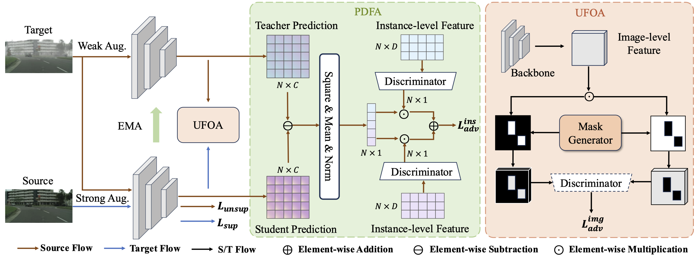

# <div align="center"> Differential Alignment for Domain Adaptive Object Detection <br> a.k.a. DA2OD</div>

<div align="center">

Official codebase for [Differential Alignment for Domain Adaptive Object Detection](https://arxiv.org/abs/2412.12830v1)

**AAAI25**



</div>

**In this paper**, we:

1) propose an instance-level alignment module (PDFA) to dynamically adjust the focus of model based on the prediction-discrepancy feedback;
2) develop an image-level alignment module (UFOA) to adaptively prioritize foreground-object areas;
3) extensive experiments are conducted to verify the efficacy of our design.

**In this repo**, we will provide:

1) Install instructions;
2) Links and construction for source and target domain datasets;
3) Codes and models for proposed DA2OD method;

<details open>
<summary><h3>Install</h3></summary>

**1. Clone this repository to your device.**

**2. Install PyTorch and torchvision.** Install the correct python and pytorch versions for your CUDA version. We provide our experimental environment below for reference:

```bash
our env:
    python3.9.19
    torch1.13.1
    CUDA11.7
```

**3. Install DA2OD.** 

```bash
cd DA2OD
pip install -e .
```

</details>

<details open>
<summary><h3>Datasets</h3></summary>

We perform adaptation experiments on three common scenarios: (1) weather adaptation with Cityscapes → Foggy Cityscapes, (2) synthetic to real adaptation with Sim10k → Cityscapes, and (3) small to large-scale dataset adaptation with Cityscapes → BDD100K-daytime. The three benchmarks involve four datasets, you can follow [these instructions](docs/DATASETS.md) to reproduce the datasets we used.

</details>

<details open>
<summary><h3>Training</h3></summary>

The training of DA2OD contains two stages: 1) warm up utilizing source-only datasets; 2) adaptation process by teacher-student mutual learning.
For each stage, training setup is curated through [config files](./configs/), and you need to modify the field values in the configuration file before starting training(especially the field values related to datasets and the num of classification classes). 

```bash
configs/
  cityscapes/
    base-rcnn-cityscapes.yaml # warm-up configs
    da2od-cityscapes.yaml    # adaptation configs
  bdd100k/
    ...
  sim10k/
    ...
```

**Run training**

Training involves running [tools/train_net.py](../tools/train_net.py) for each training phase:

```bash
python tools/train_net.py --config path/to/your/config.yaml
```

For multiple GPUs, you can run the following instruction , replace the CUDA_VISIBLE_DEVICES and num-gpus according to the actual circumstances:

```bash
CUDA_VISIBLE_DEVICES=0,1,2,3 python tools/train_net.py --config path/to/your/config.yaml --num-gpus 4
```

</details>

<details open>
<summary><h3>Evaluation</h3></summary>

After training, to run evaluation with your model:

```
python tools/train_net.py --eval-only --config-file path/to/your/config.yaml MODEL.WEIGHTS path/to/your/model.pth
```

</details>

## Model zoo

We provide the second stage models of DA2OD.

Benchmark | AP<sub>50</sub><sup>val</sup> | config| checkpoint 
| :---: | :---: | :---: | :---: |
**cityscapes &rarr; foggy_cityscapes** | 57.3 | [config](configs/cityscapes/da2od-cityscapes.yaml) | [url](https://github.com/EstrellaXyu/Differential-Alignment-for-DAOD/releases/download/initial/cityscapes_foggy_val_model_best.pth)
**cityscapes &rarr; bdd100k** | 45.8 | [config](configs/bdd100k/da2od-bdd100k.yaml) | [url](https://github.com/EstrellaXyu/Differential-Alignment-for-DAOD/releases/download/initial/bdd100k_val_model_best.pth)
**sim10k &rarr; cityscapes** | 69.7 | [config](configs/sim10k/da2od-sim10k.yaml) | [url](https://github.com/EstrellaXyu/Differential-Alignment-for-DAOD/releases/download/initial/cityscapes_cars_val_model_best.pth)

## Reference
If you find our work useful in your research, please consider citing our paper:

```
@inproceedings{he2025differential,
  title={Differential Alignment for Domain Adaptive Object Detection},
  author={He, Xinyu and Li, Xinhui and Guo, Xiaojie},
  booktitle={Proceedings of the AAAI Conference on Artificial Intelligence},
  volume={39},
  number={16},
  pages={17150--17158},
  year={2025}
}
```