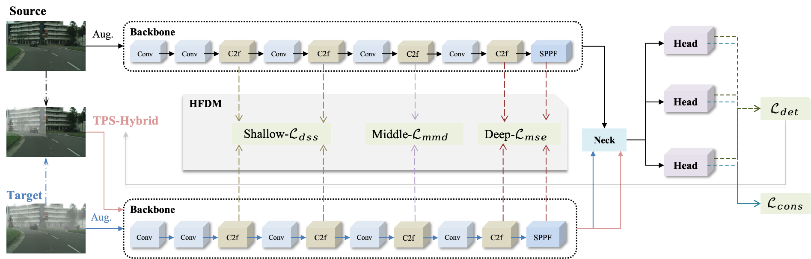

# HFDNet

## Introduction
This is our PyTorch implementation of the paper "[`Hierarchical Feature Differentiation-guided Network for domain adaptation object detection`].

<div align="center">
    
</div>

## Dataset Preparing
```bash
Cityscapes → Foggy Cityscapes
    Cityscapes: https://www.cityscapes-dataset.com/downloads/
        `Images leftImg8bit_trainvaltest.zip (11GB) [md5].
        `Annotations gtFine_trainvaltest.zip (241MB) [md5].
    Foggy CityScapes: https://www.cityscapes-dataset.com/downloads/. 
        `Images leftImg8bit_trainval_foggyDBF.zip (20GB) [md5]. 
        `Annotations are the same with `CityScapes`. 
Sim10K → Cityscapes
    Sim10K : https://fcav.engin.umich.edu/projects/driving-in-the-matrix
Pascal VOC → Clipart1k
    PascalVOC(2007+2012): follow the scripts in .dataset/VOC.yaml to build VOC datasets.
    Clipart1k: https://github.com/naoto0804/cross-domain-detection.
Public power data 
    CPLID: https://github.com/InsulatorData/InsulatorDataSet.
    VPMBGI: https://github.com/phd-benel/VPMBGI.
    # IDID: https://ieee-dataport.org/competitions/insulator-defect-detection.

🔔 '.yaml' file is in https://drive.google.com/drive/folders/1aqQfeHzpxAiJBeITXhvD-Bw0PZnLeeP0
```

## Weight
Since github can't upload large files, we uploaded the weights of the four benchmark tasks to the [Google Drive](https://drive.google.com/drive/my-drive)

## Quick Start Examples

###### Install
```bash
# clone the project and configure the environment.
git clone https://github.com/LiuJiaji1999/HFDNet.git
# the version of ultralytics is '8.2.50'           
# GPU-NVIDIA GeForce RTX 3090 
# CPU-12th Gen Intel(R) Core(TM) i9-12900
python: 3.8.18
torch:  1.12.0+cu113
torchvision: 0.13.0+cu113 
numpy: 1.22.3   
```

###### Test & Detect
```bash
python val.py
python detect.py
```

###### Train
```bash
python train.py
# nohup python train.py > /home/lenovo/data/liujiaji/powerGit/dayolo/logs/improve/c2f.log 2>&1 & tail -f /home/lenovo/data/liujiaji/powerGit/dayolo/logs/improve/c2f.log
```

###### Dual-input
```bash
/ultralytics/models/yolo/model.py
/ultralytics/models/yolo/detect/__init__.py 
/ultralytics/models/yolo/detect/uda_train.py
/ultralytics/data/uda_build.py  # load dataset  def uda_build_dataloader
/ultralytics/nn/uda_tasks.py  # update model structure
/ultralytics/engine/uda_trainer.py # update trainer
/ultralytics/utils/daca.py # compute loss 
/ultralytics/engine/validator.py  # loss
/ultralytics/cfg/default.yaml # add weight value
/ultralytics/nn/modules/head.py # head pseudo
/ultralytics/utils/plotting.py # output_to_target

```


#### Explanation of the file
```bash
# Main scripts
train.py: script to train the model
val.py: script that calculates metrics using the trained model
detect.py: inference script
# Other scripts
distill.py: distill script
export.py: export onnx scripts
gap.py: /gap 
get_FPS.py: script to calculate model storage size, model inference time-FPS
heatmap.py: script to generate heat map
main_profile.py : a script that outputs the model and the parameters and calculations for each layer of the model
track.py : script to track inference
```

### References
Reference code links are all [HERE](https://github.com/stars/LiuJiaji1999/lists/reference-da), thanks to the spirit of open source.


